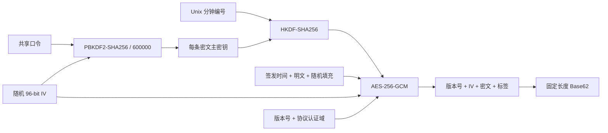

# Time Encrypt

Time Encrypt 是一个零依赖、零构建、无服务端存储的一刻钟临时密文前端原型。它在浏览器本地把短消息加密为固定 129 位字符串，并在签发后 900 秒内按本机时间完成验证。

- 在线体验：<https://zbnw.qzz.io/projects/timenc/>
- 部署位置：`zbnw/projects` 仓库的 `timenc/` 目录
- 当前写入协议：v3
- 许可证：[MIT](./LICENSE)

> [!IMPORTANT]
> 纯前端无法强制密文真正过期。任何人都可以修改本机时间或公开代码，接收方也可以保存已经解密的内容。本项目适合原型、教学和低风险临时信息；生产系统必须使用可信服务端时间与不下发给浏览器的服务端密钥。

## 特性

- 单页面完成加密、解密、复制和敏感输入清理
- AES-256-GCM 提供机密性与完整性认证
- PBKDF2-SHA256 迭代 600,000 次，每条密文使用独立随机盐材料
- HKDF-SHA256 按 Unix 分钟编号隔离分钟密钥
- 签发后第 899 秒仍可验证，第 900 秒立即拒绝
- 固定 104 位 Base62 正文，格式化为 26 组 × 4 位，共 129 位
- 固定 48 字节数据帧，避免从密文长度直接推断明文长度
- 不使用 Cookie、`localStorage`、IndexedDB、分析脚本或远程资源
- 支持键盘标签页模型、读屏状态播报与 `prefers-reduced-motion`
- 系统字体、静态渐变、每秒一次时钟刷新，兼顾首屏性能
- 保留 v2 的限时只读解密路径，便于短周期迁移

## 快速开始

项目没有依赖和构建步骤。使用静态 HTTP 服务打开目录即可：

```text
index.html
styles.css
crypto-core.mjs
app.js
```

也可以直接打开 `index.html`。若浏览器在 `file://` 页面限制 Web Crypto 或剪贴板功能，请改用本地静态 HTTP 服务或 GitHub Pages。

## 使用方法

### 生成密文

1. 输入双方预先约定的共享口令。
2. 输入最多 43 个 UTF-8 字节的短消息。
3. 选择“生成密文”，点击“生成一刻钟密文”。
4. 复制 26 组固定格式密文并发送给接收方。

共享口令的技术下限为 8 个 Unicode 字符，但建议使用至少 16 个随机字符，或 5–6 个随机单词。短口令无法因为更高迭代次数而自动变得安全。

### 解开密文

1. 切换到“解开密文”。
2. 输入相同的共享口令。
3. 粘贴完整密文；空格、换行和分组连字符会被规范化。
4. 点击“验证并解密”。认证通过且本机判断未满 900 秒时显示明文。

“清空”按钮会移除当前页面中的口令、输入和结果。页面本身不会持久化这些数据。

## 密文格式

| 项目 | v3 值 |
| --- | --- |
| 协议版本 | `3` |
| 二进制包长度 | 77 字节 |
| Base62 正文长度 | 104 字符 |
| 显示格式 | 26 组 × 4 位 |
| 含连字符总长度 | 129 位 |
| 正文字符集 | `0-9`、`A-Z`、`a-z` |
| 分隔符 | `-` |
| 明文上限 | 43 个 UTF-8 字节 |
| 验证窗口 | 900 秒 |
| 允许未来时钟偏差 | 90 秒 |

示例外观：

```text
Ab3d-91Ks-7Qmx-...-xP7Q
```

实际密文始终包含 26 个完整分组；上例仅用于展示结构。

### 二进制布局

| 偏移 | 长度 | 内容 |
| ---: | ---: | --- |
| 0 | 1 字节 | 协议版本 |
| 1 | 12 字节 | 随机 AES-GCM IV |
| 13 | 48 字节 | 加密后的固定数据帧 |
| 61 | 16 字节 | AES-GCM 认证标签 |

固定数据帧由 4 字节 Unix 签发时间、1 字节明文长度、明文和随机填充组成。

## v3 算法流程



具体步骤：

1. 浏览器生成随机 96-bit IV。
2. 共享口令通过 PBKDF2-HMAC-SHA256 迭代 600,000 次。v3 将随机 IV 与固定协议域拼接为每条密文独立的盐材料。
3. PBKDF2 输出作为 HKDF 输入，与 Unix 分钟编号和 v3 `info` 域共同派生 AES-256 密钥。
4. 签发时间、明文和随机填充组成固定 48 字节数据帧。
5. 数据帧使用 AES-256-GCM 加密；版本号和 v3 协议域作为附加认证数据，认证标签长度为 128 bit。
6. 版本、IV、密文和标签被编码为固定 104 位 Base62，再按每 4 位分组。
7. 解密端只派生一次 PBKDF2 主密钥，再尝试有效期覆盖的分钟密钥。AES-GCM 认证通过后，才检查受保护的签发时间和 UTF-8 数据。

随机 IV 同时用于公开盐材料和 AES-GCM IV；它不需要保密。v3 的派生域、HKDF `info` 和认证域彼此明确区分。

## 时间窗口语义

- 加密时把 `Math.floor(Date.now() / 1000)` 写入认证数据帧。
- 解密过程只读取一次当前时间，避免计算跨秒或跨分钟时产生不一致。
- `age < 900` 时通过时间检查，`age >= 900` 时拒绝。
- 为处理两台设备轻微不同步，解密会尝试最多 90 秒的未来分钟窗口；超过 90 秒则判定时间异常。
- 时间来自当前设备。用户回拨时钟或修改源码可以绕过前端限制，因此这不是密码学销毁机制。

四字节 Unix 时间戳会在 2106 年溢出。未来若扩展时间字段，必须发布新的协议版本。

## v2 迁移

v3 只生成新格式密文，同时保留旧 v2 的只读解密实现。v2 使用固定 PBKDF2 盐和 120,000 次迭代，安全成本较低，因此兼容路径设有明确截止时间：

```text
2026-07-14 21:06:22 UTC+8
```

截止后客户端返回“v2 密文迁移期已结束”。由于 v2 密文本身只有一刻钟验证窗口，这段兼容期只用于部署切换。若同一口令曾用于 v2，迁移后建议更换共享口令。

## 安全边界

- 密文允许攻击者离线猜测共享口令；弱口令是首要风险。
- 600,000 次 PBKDF2 增加猜测成本，但不能替代高熵口令。
- 纯前端代码和本机时间都不可信，无法保存服务端机密或强制过期。
- 固定密文长度只隐藏明文长度，不隐藏消息是否存在、发送时间范围或通信关系。
- 认证失败统一返回“口令错误、密文损坏或已经过期”，避免暴露内部认证细节。
- 本实现尚未经过独立密码学审计，不应直接处理生产高敏感数据。
- 短时有效不等于明文被销毁；接收方仍可复制、截图或保存结果。

## 项目结构

```text
.
├── index.html        # 唯一页面、语义结构和公开说明
├── styles.css        # 主题、响应式、无障碍焦点和低动效样式
├── app.js            # 状态、键盘交互、计数、复制和倒计时
├── crypto-core.mjs   # 协议 v3、限时 v2 解密和密码实现
├── README.md         # 使用、协议、安全边界和二次开发指南
└── LICENSE           # MIT License
```

密码实现只位于 `crypto-core.mjs`。界面层通过 `globalThis.TimeCrypto` 调用公开接口，不复制密钥派生或 Base62 协议逻辑。

## 二次开发指南

### 修改品牌与页面

- 产品名称、SEO 文案、算法说明和作者留言位于 `index.html`。
- 主题色、间距和响应式规则位于 `styles.css` 顶部 CSS 变量。
- 右上角站点链接默认指向 `https://zbnw.qzz.io`。
- 页面最下方 `author-message` 区域保留给维护者填写留言和署名。

请保留安全边界说明，避免把纯前端演示误认为已经过审计的生产密码系统。

### 修改有效期

在 `crypto-core.mjs` 顶部修改：

```js
const MAX_AGE_SECONDS = 900;
```

随后同步更新页面、README、分钟搜索范围和 899/900 类边界测试。有效期只改变验证策略，不会自动让旧密文销毁。

### 修改明文或密文长度

固定数据帧长度由下列参数控制：

```js
const FRAME_LENGTH = 48;
const TOKEN_GROUP_SIZE = 4;
```

当前帧头用 1 字节表示明文长度，因此 `FRAME_LENGTH - 5` 不能超过 255。改变帧布局、二进制包长度、Base62 长度或分组规则属于不兼容协议改动，必须增加 `PROTOCOL_VERSION` 并同步页面说明和测试。

### 修改派生成本或密码域

```js
const PBKDF2_ITERATIONS = 600000;
const PROTOCOL_VERSION = 3;
```

修改 PBKDF2 次数、盐结构、HKDF 参数、AES-GCM 参数或认证域时：

1. 增加协议版本。
2. 更换 PBKDF2、HKDF `info` 和认证数据中的版本域。
3. 先读取版本字节，再按版本选择解密器和口令校验规则。
4. 给旧版本设置明确的只读迁移截止时间。
5. 为新旧版本分别建立固定向量、错误口令、篡改和时间边界测试。

正式调整 PBKDF2 工作因子前，应在目标桌面和移动设备基准测试。合法用户的一次计算通常应保持在可接受的交互时间内。

### 迁移到后端

生产版本可以保留当前页面交互，把 `app.js` 对 `encryptMessage` / `decryptMessage` 的调用替换为 HTTPS API。服务端应：

- 保存并轮换高熵主密钥，浏览器不得获得该密钥
- 使用可信时间判断签发与过期
- 把版本、时间、业务范围和必要元数据放入认证数据
- 保持无状态时，把必要状态封装到认证密文，而不是省略密钥管理
- 增加请求频率限制、统一错误响应、审计与自动化测试

## 最低验证清单

每次修改协议或交互后至少验证：

- [ ] 正确口令可完成 v3 加密和解密
- [ ] 错误口令被统一拒绝
- [ ] 任意篡改正文、版本或认证数据均失败
- [ ] 相同明文连续加密产生不同密文
- [ ] 第 899 秒可解密，第 900 秒立即失效
- [ ] 未来 90 秒时钟偏差可解，91 秒被拒绝
- [ ] 43 字节成功，44 字节失败
- [ ] 中文、英文、数字和 Unicode 边界正常
- [ ] 密文始终为 129 位、26 组、每组 4 位
- [ ] 正文只包含 Base62 字符，分隔符只使用连字符
- [ ] v2 在迁移截止前可读，截止后被拒绝
- [ ] 所有 `app.js` 引用的元素 ID 唯一存在
- [ ] 加密期间切换模式或重复提交不会产生竞态
- [ ] 键盘、读屏状态、复制降级和移动端布局可用
- [ ] 页面不发起外部网络请求，用户主动点击站点链接除外

## GitHub Pages 部署

页面可直接部署到 GitHub Pages，不需要 CI 构建：

1. 把六个项目文件放入目标仓库的 `timenc/` 目录。
2. 保持所有 CSS 和脚本引用为相对路径。
3. 在仓库 Pages 设置中选择主分支静态部署。
4. 发布后访问 `/projects/timenc/`，核对资源、交互和浏览器控制台。

当前线上地址：<https://zbnw.qzz.io/projects/timenc/>

## 浏览器要求

需要支持以下 Web API 的现代浏览器：

- Web Crypto API：PBKDF2、HKDF、AES-GCM
- `TextEncoder` / `TextDecoder`
- `BigInt`
- Clipboard API（不可用时页面会选中文本供手动复制）

建议使用当前版本的 Chrome、Edge、Firefox 或 Safari。

## 许可证

本项目基于 [MIT License](./LICENSE) 开源。你可以复制、修改、部署并用于个人或商业项目，但必须保留许可证和版权声明。本项目按“原样”提供，不包含任何安全性、适销性或特定用途适用性担保。

