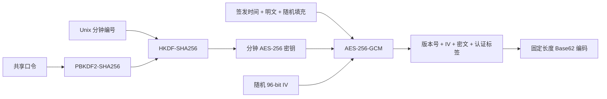

# Time Encrypt

一个无依赖、无服务端存储的一刻钟临时密文前端原型。共享口令与当前时间共同派生密钥，密文签发后 15 分钟内可以解密，超过有效期自动拒绝。

> 当前版本用于产品原型和交互验证。浏览器端代码与本机时间都不可信，不应直接用于生产环境的高敏感数据。

在线体验：<https://zbnw.qzz.io/projects/timenc/>

## 功能

- 单页面完成加密与解密
- 按分钟派生 AES-256-GCM 密钥
- 签发后精确 900 秒失效
- 固定长度 Base62 密文
- 不使用 Cookie、`localStorage` 或数据库
- 无框架、无第三方依赖、无构建步骤
- 适配桌面端和移动端
- 页面底部预留项目说明区域

## 在线部署

该项目是纯静态页面，可直接部署到 GitHub Pages：

1. 将项目推送到 GitHub 仓库。
2. 打开仓库的 **Settings → Pages**。
3. 在 **Build and deployment** 中选择 **Deploy from a branch**。
4. 选择主分支和根目录 `/ (root)`，保存后等待部署完成。

## 本地运行

直接打开 [`index.html`](./index.html) 即可使用。

如果浏览器限制本地文件的 Web Crypto API，请通过任意静态 HTTP 服务打开项目，或部署到 GitHub Pages。页面本身不会发起外部网络请求。

## 使用方法

### 生成密文

1. 输入双方预先约定的共享口令，口令至少 8 位。
2. 输入需要加密的内容，最多 43 个 UTF-8 字节。
3. 点击“生成一刻钟密文”。
4. 复制固定格式密文并发送给接收方。

### 解开密文

1. 切换到“解开密文”。
2. 输入与发送方相同的共享口令。
3. 粘贴完整密文并点击“验证并解密”。
4. 口令正确且签发时间未超过 900 秒时显示原文。

## 密文格式

| 项目 | 值 |
| --- | --- |
| 原始编码长度 | 104 个 Base62 字符 |
| 显示格式 | 26 组 × 4 位 |
| 包含分隔符后的长度 | 129 位 |
| 字符集 | `0-9`、`A-Z`、`a-z` |
| 分隔符 | `-` |
| 明文上限 | 43 个 UTF-8 字节 |
| 有效期 | 900 秒（15 分钟） |

示例结构：

```text
Ab3d-91Ks-...-xP7Q
```

## 算法流程



具体步骤：

1. 共享口令通过 PBKDF2-SHA256 迭代 120,000 次，派生 256-bit 主密钥。
2. 主密钥与 Unix 分钟编号通过 HKDF-SHA256 派生当前分钟密钥。
3. 明文与签发时间被封装为固定 48 字节数据帧。
4. 数据帧使用 AES-256-GCM 和随机 96-bit IV 加密。
5. 版本号、IV、密文及认证标签被编码为固定长度 Base62 字符串。
6. 解密端尝试有效期内的分钟密钥，并检查密文内部签发时间是否小于 900 秒。

## 项目结构

```text
.
├── index.html        # 唯一页面与页面文案
├── styles.css        # 页面样式与响应式布局
├── app.js            # 页面交互逻辑
├── crypto-core.mjs   # 浏览器端密码原型
├── README.md         # 项目文档与二次开发指南
├── LICENSE           # MIT 开源许可证
└── .gitignore        # Git 忽略规则
```

## 二次开发指南

本项目采用 MIT 许可证，可以 Fork、修改、部署并用于自己的项目。密码算法本身无需保密：可靠的加密系统应依靠密钥保密，而不是依靠隐藏实现细节。

### 1. 修改品牌和说明

- 页面名称、标题和算法说明位于 [`index.html`](./index.html)。
- 颜色、间距和响应式布局位于 [`styles.css`](./styles.css)。
- 全局主题色由 `styles.css` 顶部的 `--acid` 等 CSS 变量控制。

建议保留页面中的安全边界说明，避免使用者将浏览器原型误认为已经过审计的生产密码系统。

页面最下方的作者留言位于 `author-message` 区域。修改其中的 `blockquote` 和 `author-signature` 即可填写留言与署名。右上角站点链接位于 `site-link`，默认指向 `https://zbnw.qzz.io`。

### 2. 修改有效期

在 [`crypto-core.mjs`](./crypto-core.mjs) 顶部修改：

```js
const MAX_AGE_SECONDS = 900;
```

分钟窗口数量会自动根据该值计算。还需要同步更新 `index.html` 和 `app.js` 中的“一刻钟”界面文案，以及 README 中的格式说明。

### 3. 修改明文长度

修改固定数据帧长度：

```js
const FRAME_LENGTH = 48;
```

最大明文长度、二进制包长度和 Base62 输出长度都会自动重新计算。当前明文长度字段只有 1 字节，因此 `FRAME_LENGTH - 5` 不能超过 255；如果需要更长明文，应先扩展帧头协议。

输出长度变化后，应同步修改 `index.html` 中“26 组 × 4 位”的说明。分组大小由以下参数控制：

```js
const TOKEN_GROUP_SIZE = 4;
```

### 4. 修改口令派生成本

PBKDF2 迭代次数集中在：

```js
const PBKDF2_ITERATIONS = 120000;
```

提高迭代次数会增加暴力猜测成本，也会增加低性能设备上的等待时间。正式部署前应在目标设备上进行基准测试，而不是直接套用固定数值。

### 5. 发布不兼容的新协议

如果修改了数据帧、派生方式、字符编码或认证参数，应执行以下操作：

1. 增加 `PROTOCOL_VERSION`。
2. 更换 PBKDF2 盐和 HKDF `info` 中的版本域，例如从 `v2` 改为 `v3`。
3. 解密时先读取版本号，再分派到对应版本的解析器。
4. 保留旧版解析器直到旧密文的有效期和迁移期结束。
5. 增加新旧版本的固定测试向量和错误口令测试。

不要在保持版本号不变的情况下改变密文格式，否则相同外观的密文会出现不可预测的兼容问题。

### 6. 替换为服务端实现

生产版本可保留当前页面，将 `app.js` 中的 `encryptMessage` / `decryptMessage` 调用替换为 HTTPS API。服务端应持有高熵主密钥并使用可信时间；浏览器不应获得服务端主密钥。

无状态不等于无密钥：服务端可以不保存每条密文，但仍需安全保存并轮换主密钥。签发时间、版本号和业务范围应放入经过认证的数据中。

### 7. 修改后的最低验证清单

- 同一口令能够完成加密和解密。
- 错误口令、被篡改密文和错误版本全部失败。
- 有效期前一秒可以解密，到达边界立即失败。
- 连续加密相同明文会因随机 IV 得到不同密文。
- 输出长度、字符集和分组始终固定。
- 中文、英文、数字及 UTF-8 字节上限均有测试。
- 桌面端和移动端页面均能正常操作。

## 安全边界

- 纯前端代码对访问者完全可见，不能保存服务端机密。
- 有效期依赖设备时间，用户修改本机时间可能影响验证结果。
- 共享口令强度直接决定抗暴力破解能力。
- 该实现尚未经过独立密码学审计。
- 短时间有效不等同于密文能够被真正销毁；接收方仍可保存解密后的明文。

## 后端迁移建议

生产版本建议由后端持有主密钥并提供可信时间，前端只负责提交明文或密文。服务端可以继续保持无状态：将签发时间和必要元数据封装在经过认证的密文中，无需保存每条密文记录。

迁移时还应补充：

- 密钥轮换和算法版本管理
- 请求频率限制与暴力破解防护
- 服务端与客户端时钟偏差策略
- 统一错误响应，避免暴露验证细节
- 自动化测试与正式安全审计

## 浏览器要求

需要支持以下 Web API 的现代浏览器：

- Web Crypto API
- `TextEncoder` / `TextDecoder`
- `BigInt`

建议使用当前版本的 Chrome、Edge、Firefox 或 Safari。

## 许可证

本项目基于 [MIT License](./LICENSE) 开源。你可以修改并用于个人或商业项目，但必须保留许可证和版权声明。本项目按“原样”提供，不包含任何安全性或适销性担保。
